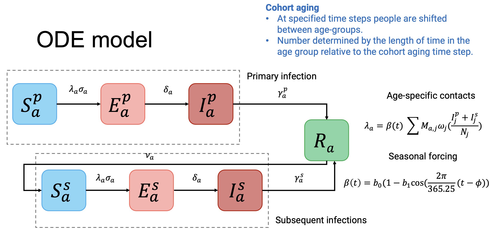

<!-- README.md is generated from README.Rmd. Please edit that file -->

```{r, include = FALSE}
knitr::opts_chunk$set(
  collapse = TRUE,
  comment = "#>",
  fig.path = "man/figures/README-",
  out.width = "100%"
)
```

# RSVsim

<!-- badges: start -->
[](https://github.com/IsaacStopard/RSVsim/actions/workflows/R-CMD-check.yaml)
[](https://app.codecov.io/gh/IsaacStopard/RSVsim)
<!-- badges: end -->

A deterministic, ODE model of Respiratory Synctial Virus (RSV) transmission. This package is under constant development, so will change without notice. The current model outputs are yet to be fully tested.

## Installation

You can install the development version of RSVsim from [GitHub](https://github.com/) with:

```r
# install.packages("pak")
pak::pak("IsaacStopard/RSVsim")
```

## Model structure
The model is an adapted version of an susceptible-exposed-infectious-recovered-susceptible (SEIRS) deterministic, ordinary differential equation (ODE) model outlined in: 

- Hogan, A. B., Campbell, P. T., Blyth, C. C., Lim, F. J., Fathima, P., Davis, S., ... & Glass, K. (2017). Potential impact of a maternal vaccine for RSV: a mathematical modelling study. Vaccine, 35(45), 6172-6179, <https://doi.org/10.1016/j.vaccine.2017.09.043>,

- Nazareno, A. L., Newall, A. T., Muscatello, D. J., Hogan, A. B., & Wood, J. G. (2024). Modelling the epidemiological impact of maternal respiratory syncytial virus (RSV) vaccination in Australia. Vaccine, 42(26), 126418, <https://doi.org/10.1016/j.vaccine.2024.126418>.

In brief, the model is age-structured and primary (the first, $p$) and secondary infections (any subsequent infection, $s$) are specifically tracked. The force of infection is determined by a seasonal forcing function ($\beta$) and the age-specific contact matrix (the mean contacts per person, $M$). The population is stratified into susceptible ($S$), exposed ($E$), infectious ($I$) and recovered states ($R$).


