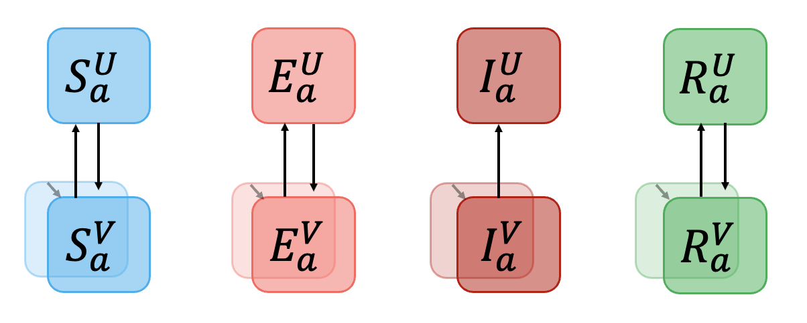

```{r, include = FALSE}
knitr::opts_chunk$set(
  collapse = TRUE,
  comment = "#>",
  cache = TRUE,
  autodep = TRUE
)
```

```{r setup, eval=FALSE}
library(RSVsim)
```

In this vignette, we give an overview of how to implement vaccination in the model. By default, the vaccination coverage is 0 (meaning there is no vaccination). Vaccination is implemented to those in the S, E and R states according to a vaccination rate (per person per day). The number of vaccination states (`nVaccStates`) must be input in the model parameters; the minimum number of vaccination states is 2, which corresponds to unvaccinated (U) and vaccinated (V). Intermediate vaccination states can also be implemented to account for a delay in vaccine-derived protection or Erlang distributed vaccination waning times. 



In the example below we show how to implement a single 30-day vaccination campaign to achieve an approximate coverage of 80% in those over 70 years old.


```{r run_with_vaccination, dependson="setup", eval=FALSE}

# setting up the contact matrix and ages used
contact_population_list <- RSVsim_contact_matrix()

max_time <- 365.25

# vaccination times - must include 0 
# vaccination starts on day 90 and ends on day 120
vaccine_times <- c(0, 90, 120)
vaccine_period <- diff(c(vaccine_times, max_time))
nVaccTimes <- length(vaccine_times)
nAges <- length(contact_population_list$age_limits)

# vaccination coverage
# set as zero unless in the oldest age group
vaccine_cov <- rbind(matrix(rep(0, (nAges-1) * nVaccTimes), 
                            nrow = (nAges-1), ncol = nVaccTimes), 
                     c(0, 0.80, 0))

# not necessary but included for completeness
nVaccStates <- 2
VE <- matrix(rep(0.85, nAges * (nVaccStates-1)), nrow = nAges) # vaccine efficacy
gamma_vaccine <- 1 / (365.25 * 2)

# specify the parameters
parameters <- RSVsim_parameters(overrides = list("vaccine_times" = vaccine_times,
                                                 "vaccine_period" = vaccine_period,
                                                 "nVaccTimes" = nVaccTimes,
                                                 "vaccine_cov" = vaccine_cov,
                                                 "nVaccStates" = nVaccStates,
                                                 "VE" = VE,
                                                 "gamma_vaccine" = gamma_vaccine
                                                 ),
                                contact_population_list = contact_population_list)

RSVsim_run_model(parameters = parameters,
                 times = seq(0, max_time, 0.25),
                 cohort_step_size = 1/12 * 365.25,
                 warm_up = NULL)

```

The `gamma_vaccine` parameter must be the length of `nVaccStates - 1` and corresponds to the transition rate between vaccinated states with the final value corresponding to the transition rate back to the unvaccinated state. Vaccine efficacy (`VE`; matrix) is age and vaccine state specific with the rows corresponding to the age group and the columns corresponding to the vaccinated state. To implement vaccination we must specify the times at which vaccination coverage changes (`vaccine_times`; vector of length `nVaccTimes`) and the approximate coverage at each vaccination distribution time (`vaccine_cov`; matrix: rows correspond to each age group and columns correspond to the vaccination time). The vaccination rate between each time is assumed to be constant and calculated to give the `vaccine_cov` value at the time when the vaccine coverage changes. To do so, the `vaccine_period` corresponding to the difference in times between the vaccination times is given. The vaccination rate is then calculated in the model thus, `-log(1 - vaccine_cov[i,j]) / vaccine_period[j]`, which assumes no vaccine waning and the effective vaccination coverage should be calculated from the model outputs. The numbers of doses administered are given as a default model output. 
